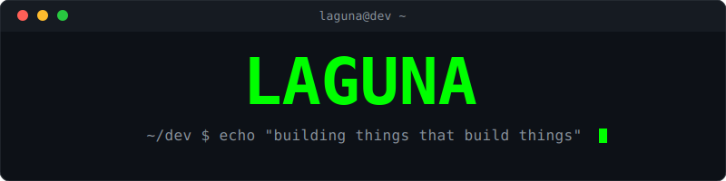

<div align="center">



[](https://git.io/typing-svg)

</div>

---

### `> whoami`

I'm Laguna — CTO at [Trike](https://trike.co) and currently building an integration system for [Scheme](https://scheme.com). Been shipping code since 2013. I like building developer tools and automating anything that sits still long enough.

I believe the best code is the code you don't have to write twice.

---

### `> cat tech_stack.md`

**Languages I think in:**


**Frameworks & tools I reach for:**


**Where I live:**


---

### `> ls projects/`

| Project | What it does | Built with |
|---|---|---|
| [**Overlord**](https://github.com/LagunaElectric/Overlord) | Local dev dashboard — manage repos, tasks, env vars, and workflows | Vue / Python / FastAPI |
| [**regex-factory**](https://github.com/LagunaElectric/regex-factory-v2) | Visual regex builder & tester | Vue / Nuxt |

---

### `> neofetch`

<div align="center">

<a href="https://github.com/LagunaElectric">
  
</a>

</div>

---

### `> tail -f currently.log`

```
🚀 CTO at Trike.co
🔧 Building an integration system for Scheme
⚡ Automating everything I can get my hands on
```

---

<div align="center">


```
$ exit
```

</div>